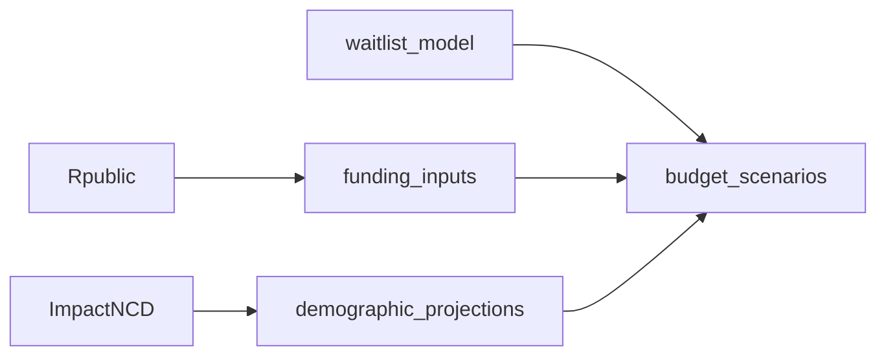

# The REAL Centre

Hi!

Welcome to the REAL Centre's main git page. We represent a collaboration of Economists as part of The Health Foundation. Our work is aimed at producing economic analyses and modelling of Health & Care, ranging from public finance projections to workforce supply and productivity estimates.

If you have any questions, contact us at realcentre@health.org.uk.

### 2024/25 Funding Projections
Creates long-term NHS/DHSC TDEL growth scenarios, splitting funding growth by POD (Elective, Emergency, etc...) and type (CDEL, RDEL). Funding Projections utilises epidemological projections from The REAL Centre's 'Health In 2040', which is in turn based on The University of Liverpool's ImpactNCD model. This work is thus able to identify the element of underlying growth attributed to changes in either demography, morbidity, or meeting certain policy outcomes such as meeting NHSE's constitutional elective standards.

| Repository              | Status        |
| -------------           |:-------------:| 
| [budget_scenarios](https://github.com/zeyadissa/budget_scenarios)     | `Pre-release` | 
| [funding_inputs](https://github.com/REALCentreTHF/funding_projections)     | `Pre-release` | 
| [waitlist_model](https://github.com/zeyadissa/waitlist_model)          | `Pre-release` |  
| demand_projections | `Unreleased`  | 
| [ImpactNCD](https://github.com/ChristK/IMPACTncd_Liverpool)             | `Release`     | 
| [Rpublic](https://github.com/zeyadissa/Rpublic)                 | `Pre-release` |

